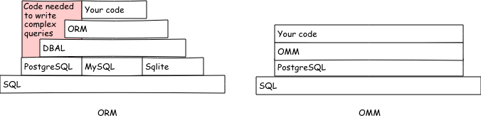

# What’s elephantry?

Elephantry is an OMM, object model manager, a tool to interact with a database
like an ORM but with an opposite philosophy.

In both cases, the goal is to make the link between a database and its
relational model and your application using the object paradigm.

The ORM approach consists in mapping the relational model in the object world
and making your code the reference to design the database.

In addition, ORM comes with an abstraction layer (DBAL) that allows you to
transparently use multiple databases. As a result, they have to limit themselves
to the database with the least functionality. The [SQL
evolves](https://modern-sql.com) and you miss out on many features that
can help you solve your problems effectively.

An OMM lets the database manage what it can do best, and takes care of
presenting to your application easily manipulated data as simple objects.
The OMM is a simple convertion layer and will help you by avoiding writing
the simplest queries (insert, update and delete) as an ORM but let you writing
more complex queries without overhead.



The first consequence of this is a much simpler tool. As a
comparison [doctrine](https://www.doctrine-project.org/projects/orm.html)
(the most popular ORM in the PHP ecosystem) includes 230,850 lines of code
compared to 24,906 for [POMM](http://www.pomm-project.org)¹.

The second consequence you’ll unleashed the power of SQL and using all of its
power.

A OMM puts the database back at the heart of data management and not just an
object persistent layer.

If you want to read more about the difference between ORM and OMM, you can read
[Why Pomm?](http://www.pomm-project.org/news/why-pomm.html)

# Setting

This paradigm change involves we should start by design our database instead of
our objects.

```sql
create table department (
    department_id serial primary key,
    name text not null,
    parent_id integer references department (department_id)
);

create table employee (
    employee_id serial primary key,
    first_name text not null,
    last_name  text not null,
    birth_date date not null check (age(birth_date) >= '18 years'::interval),
    is_manager boolean not null default false,
    day_salary numeric(7,2) not null,
    department_id integer not null references department (department_id)
);
```

See the [structure.sql](../core/examples/structure.sql) file for complete source with data
sample.

# Connection

First of all, it is necessary to connect to the database. In a very classical
way, this is done thanks to its URL:

```rust
let database_url = std::env::var("DATABASE_URL")
    .expect("DATABASE_URL must be set");
let elephantry = elephantry::Pool::new(&database_url)?;
```

If you prefer the legacy way (like `psql`), you can use
`elephantry::Pool::from_config`:

```rust
let elephantry = elephantry::Pool::from_config(&elephantry::Config::default())?;
```

`elephantry::Config` discorvers missing parameters from environment variables
(`PGUSER`, `PGHOST`, `PGDATABASE`, `PGPORT` and `PGPASSWORD`) and `PGPASSFILE`
file.

You can see the
[explain code
source](https://github.com/sanpii/explain/blob/1.2.0/src/main.rs#L106-L108)² to
see an example how to use this with `structopt` (it’s easy like impl the `Into`
trait).

# Querying

## Primitive types

From there, it is already possible to make simple queries and get the results
autautomatically typed in rust:

```rust
let results = elephantry.execute("select * from department")?;

for result in &results {
    let name: String = result.get("name");
    println!("{}", name);
}
```

Simple, isn’t it? To avoid panic if the field does not exist, it’s a good idea
to use the `Tupple::try_get` function:

```rust
let missing_field: i32 = results.get(0).try_get("missing_field")?;
```

The `Rows::get` function allows you to retrieve a result line without going
through all records³.

Similarly if the field is `null` (because `null` can’t be transformed to `i32`):

```rust
let parent_id: i32 = results.get(0).try_get("parent_id")?;
```

In this case, it is possible to use the `Option` type:

```rust
let parent_id: Option<i32> = results.get(0).get("parent_id");
```

See [01-execute.rs](../core/examples/01-execute.rs).

# Entity

Now that we’ve seen how to pick up simple guys, it’s possible to go further to
directly retrieve an entity as a structure. To do this, our structure must
implement the `elephantry::Entity` trait, to help you with this repetitive work,
you can use the `elephantry::Entity` derive macro:

```rust
mod employee {
    #[derive(Clone, Debug, elephantry::Entity)]
    struct Entity {
        employee_id: i32,
        first_name: String,
        last_name: String,
        birth_date: chrono::NaiveDate,
        is_manager: bool,
        day_salary: f32,
        department_id: crate::Interval,
    }
}
```

Thanks to this, you can use the `Connection::query` function which allows you to
directly retrieve entities:

```rust
let employee = elephantry.query::<employee::Entity>(
    "select * from employee",
    &[],
)?;

for employee in employees {
    dbg!(employee);
}
```

The second parameter of the `Connection::query` function allows you to pass
parameters to our query, for example to retrieve a record with its id:

```rust
let employees = elephantry.query::<employee::Entity>(
    "select * from employee where is_manager = $1",
    &[&true],
)?;
```

This saves you from having to pay attention to special characters and protects
you against SQL injections.

Simple types already implement the `Entity` tray, that imply if your
query returns one column, you can simply get its.

In addition, if you are only interested by the first row, you can use
`Connection::query_one`.

```rust
let total_salary = elephantry.query_one::<bigdecimal::BigDecimal>("select sum(day_salary) from employee", &[])?;
```

See [02-query.rs](../core/examples/02-query.rs).

## Model

We now come to the heart of the OMM principle with the trio
entity/model/structure that will allow us to make the link between a table of
our database and our entity, while maintaining a certain amount of flexibility.

We have already seen the entities that will contain our data.

The `elephantry::Structure` trait will contain the information about a table:

```rust
struct Structure;

impl elephantry::Structure for Structure {
    fn relation() -> &'static str {
        "public.employee"
    }

    fn primary_key() -> &'static [&'static str] {
        &["employee_id"]
    }

    fn definition() -> &'static [&'static str] {
        &[
            "employee_id",
            "first_name",
            "last_name",
            "birth_date",
            "is_manager",
            "day_salary",
            "department_id",
        ]
    }
}
```

The `elephantry::Structure::relation` function returns the name of the table
(but it can be a view), `elephantry::Structure::primary_key` the field or fields
composing the primary key, and finally `elephantry::Structure::definition` will
contain the list of the fields of our table.

And finally the `elephantry::Model` feature allows to make the link between an
entity and a structure:

```rust
struct Model;

impl<'a> elephantry::Model<'a> for Model {
    type Entity = Entity;
    type Structure = Structure;

    fn new(_: &'a elephantry::Connection) -> Self {
        Self {
        }
    }
}
```

This information is linked to your database and therefore has little ability to
change, the `elephantry-cli` utility generates them for you:

```
DATABASE_URL='postgres://localhost/elephantry' elephantry generate:schema-all
```

This being defined, you can now request our entities without taking care to
write the entire request:

```rust
let employees = elephantry.find_all::<employee::Model>(None)?;

for employee in employees {
    dbg!(employee);
}
```

The `elephantry::Connection` structure provides additional functions to retreive
your data :

- [`Connection::find_by_pk`](https://docs.rs/elephantry/0.1.0/elephantry/connection/struct.Connection.html#method.find_by_pk);
- [`Connection::find_all`](https://docs.rs/elephantry/0.1.0/elephantry/connection/struct.Connection.html#method.find_all);
- [`Connection::find_where`](https://docs.rs/elephantry/0.1.0/elephantry/connection/struct.Connection.html#method.find_where);
- [`Connection::paginate_find_where`](https://docs.rs/elephantry/0.1.0/elephantry/connection/struct.Connection.html#method.paginate_find_where);
- [`Connection::count_where`](https://docs.rs/elephantry/0.1.0/elephantry/connection/struct.Connection.html#method.count_where);
- [`Connection::exist_where`](https://docs.rs/elephantry/0.1.0/elephantry/connection/struct.Connection.html#method.exist_where).

See [03-read.rs](../core/examples/03-read.rs).

# Modification

- [`Connection::insert_one`](https://docs.rs/elephantry/0.1.0/elephantry/connection/struct.Connection.html#method.insert_one);
- [`Connection::update_one`](https://docs.rs/elephantry/0.1.0/elephantry/connection/struct.Connection.html#method.update_one);
- [`Connection::update_by_pk`](https://docs.rs/elephantry/0.1.0/elephantry/connection/struct.Connection.html#method.update_by_pk);
- [`Connection::delete_one`](https://docs.rs/elephantry/0.1.0/elephantry/connection/struct.Connection.html#method.delete_one);
- [`Connection::delete_by_pk`](https://docs.rs/elephantry/0.1.0/elephantry/connection/struct.Connection.html#method.delete_by_pk);
- [`Connection::delete_where`](https://docs.rs/elephantry/0.1.0/elephantry/connection/struct.Connection.html#method.delete_where).

Theire functions return the impacted entity(ies).

See [04-write.rs](../core/examples/04-write.rs).

# Additional informations

So far we have covered the basic functionality, it is you’re probably wondering
what the point of an ORM is.

That’s where the database is going to be our best ally. Rather than to get our
base entities back and then operate on them in order to extend them to
finally display them, we will directly ask to PostgreSQL to enrich our entities
and retrieve them with these additional fields (where, why not, don’t get all
fields⁴).

This will be possible with the model. The default projection⁵ contains all
the fields of our table, but it is possible to defin another one via the
`elephantry::Model::create_projection` function:

```rust
impl<'a> elephantry::Model<'a> for Model {
    fn create_projection() -> elephantry::Projection {
        Self::default_projection()
            .add_field("age", "age(%:birth_date:%)")
    }
}
```

Here we add to our select a field that will contain the age of the employee.
Note the notation `%:birth_date:%` which will be replaced by the name complete
the field and escape if necessary.

Without forgetting to add this field to our entity:

```rust
struct Entity {
    employee_id: i32,
    first_name: String,
    last_name: String,
    birth_date: chrono::NaiveDate,
    is_manager: bool,
    day_salary: f32,
    department_id: i32,
    age: u32,
}
```

Now by doing a `find_all` we automatically retrieve this new field:

```rust
let employees = elephantry.find_all::<employee::Model>(Some("order by age"))?;

for employee in employees {
    dbg!(employee);
}
```

See [05-extra.rs](../core/examples/05-extra.rs).

You can already use the power of SQL, such as the [window
functions](https://modern-sql.com/blog/2019-02/postgresql-11#over), for example,
compute the difference between each `day_salary`:

```sql
select first_name, last_name, day_salary,
    day_salary - lag(day_salary) over(order by day_salary) as difference
    from employee;

┌─────────────┬────────────┬────────────┬────────────┐
│ first_name  │ last_name  │ day_salary │ difference │
├─────────────┼────────────┼────────────┼────────────┤
│ sébastien   │ grossein   │    3900.98 │          ¤ │
│ louise      │ monacor    │    4100.00 │     199.02 │
│ alexandre   │ jardin     │    4500.00 │     400.00 │
│ david       │ garadjian  │    4500.00 │       0.00 │
│ patrick     │ cordier    │    4700.00 │     200.00 │
│ jérome      │ binet      │    4800.00 │     100.00 │
│ estelle     │ li jih     │    5300.00 │     500.00 │
│ ishaam      │ elraouï    │    5600.00 │     300.00 │
│ jean-pierre │ kassem     │    8700.00 │    3100.00 │
│ david       │ roneker    │    9000.00 │     300.00 │
│ laurent     │ galatier   │   13850.00 │    4850.00 │
│ michèle     │ pfizer     │   15000.00 │    1150.00 │
│ alexis      │ gelbetchev │   17500.00 │    2500.00 │
│ jean        │ dupont     │   20000.00 │    2500.00 │
└─────────────┴────────────┴────────────┴────────────┘
```

Simply add this field to your projection. I leave you imagine the same thing
done in rust.

# Complex requests

Maybe you wish to make a request more complex than simply change the projection,
for example, an aggregate to sum up even numbers.

SQL has the advantage of being a high level language: if your query compiles it
will run without error (like rust ^^). So I encourage you, for more complex
requests, write them yourself. Elephantry helps you not to copy certain
information.

This is done in our model.

To start, we’re going to handle the connection to the database so that we can
execute our request:

```rust
struct Model<'a> {
    connection: &'a elephantry::Connection,
}

impl<'a> elephantry::Model<'a> for Model<'a> {
    type Entity = std::collections::HashMap<String, i32>;
    type Structure = Structure;

    fn new(connection: &'a elephantry::Connection) -> Self {
        Self {
            connection
        }
    }
}
```

Note here we do not define an entity, we will use a simple hash table (which
implements `elephantry::Entity`) to store our results.

Now all we have to do is write down our function:

```rust
impl<'a> Model<'a> {
    pub fn managers_salary(&self) -> elephantry::Result<i32> {
        let query = "select sum(day_salary) from employee where is_manager";

        let result = self.connection.execute(query)?
            .get(0)
            .get("sum");

        Ok(result)
    }
}
```

And finally, we retrieve our model from our connection to run our request:

```rust
let model = elephantry.model::<employee::Model>();
let managers_salary = model.managers_salary()?;
```

See [06-complex.rs](../core/examples/06-complex.rs).

# Relationships

When you get here, you must have at least one question left: how do you deal
with relations of our entity?

With an ORM, we retrieve the employee we are interested in and then use a method
`get_departement` which will launch a new query to retrieve its department.

It’s in cases like that we need to think the exact opposite with the ORM
approach: we will make only one query and retrieve our employee as well as his
departments. Our SQL query will present the given in such a way that there’s
simply a transformation of the types to be done. This is possible because
PostgreSQL knows how to handle arrays, so we’re going to (via the projection)
add a department table and all this will be transformed by elephantry into an
entity:

```rust
use elephantry::{Model, Structure};

#[derive(Clone, Debug, elephantry::Entity)]
pub struct Entity {
    pub employee_id: i32,
    pub first_name: String,
    pub last_name: String,
    pub birth_date: chrono::NaiveDate,
    pub is_manager: bool,
    pub day_salary: bigdecimal::BigDecimal,
    pub departments: Vec<String>,
}

impl<'a> Model<'a> {
    pub fn employee_with_department(&self, id: i32) -> elephantry::Result<super::Employee> {
        let query = r#"
select {projection}
    from {employee}
    join {departments} using(department_id)
    where employee_id = $1
    group by employee_id
"#;

        let projection = Self::create_projection()
            .unset_field("department_id")
            .add_field("department", "array_agg(department.name)");

        let sql = query
            .replace("{projection}", &projection.to_string())
            .replace("{employee}", <Self as elephantry::Model>::Structure::relation())
            .replace("{department}", super::department::Structure::relation());

        Ok(self.connection.query::<super::Employee>(&sql, &[&id])?.get(0))
    }
}
```

Ok, it’s a simple query because we retreive only one department per employee,
but a department can have a parent! Why don’t you retreive its hierarchie? The
query is a little more complex, especially if you aren’t familiar with
[recurcive CTE](https://www.postgresql.org/docs/current/queries-with.html), here
the SQL query:

```SQL
with recursive
    depts (department_id, parent_id, name) as (
        select d.department_id, d.parent_id, d.name from department d join employee e using(department_id) where e.employee_id = $1
        union all
        select d.department_id, d.parent_id, d.name from depts parent join department d on parent.parent_id = d.department_id
    )
select e.*, array_agg(depts.name) as departments
    from employee e, depts
    where e.employee_id = $1
    group by e.employee_id;
```

And you can see [07-relations](../core/examples/07-relations.rs) for the
complete example. How many queries do you think would be executed with an
ORM?⁶

You know everything there is to know about elephantry, the rest depends on your
imagination and your mastery of SQL.

To go further on this last point:

- [Modern SQL](https://modern-sql.com);
- [The Art of PostgreSQL](https://theartofpostgresql.com).

# Async

`Connection::execute`, `Connection::query` and `Connection::query_one` are
available in async context. To benefit from it, simply use the
`Connection::r#async` function:

```rust
let results = elephantry.r#async().query::<employee::Entity>("select * from employee").await?;
```

You can see the [08-async.rs](../core/examples/08-async.rs) example⁷, it’s a
rewrite of second example in async context.

---

¹ We’re on the same diesel to elephantry ratio.

² A tool that launches like `psql` but explain a query instead of execute its.

³ Constant time access O(1).

⁴ This is particularly useful for not retrieving sensitive data like
  passwords.

⁵ The projection is the list of fields in the SELECT part of the request.

⁶ 1 for the employee plus 1 per department, 4 here. The time taken by a
  query isn’t just the time to execute it. Every time you should add the network
  latency plus the time the ORM transforms results in objet.

⁷ The relevance of this example is limited because the underlayed driver, libpq,
supports only one async query at a time.
